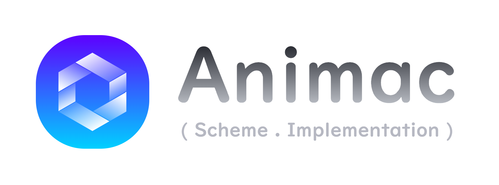

**灵机 · Animac**是[Scheme](https://www.scheme.org/)程序语言的一个解释器实现，由C语言和TypeScript编写，能够在MCU、Web浏览器、Node.js等各类环境中运行。Animac不遵守RnRS标准。Animac可将JavaScript子集转译为Scheme解释执行。

本仓库为临时仓库，未来将合入[主仓库](https://github.com/bd4sur/Animac)。

